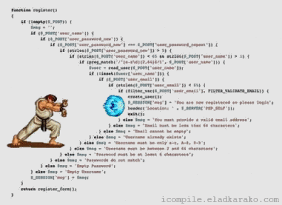

# JavaScript - Advance 4 (Ajax and APIs)

## 1. Sync and Async

Synchronous code 同步

- JavaScript is a single-thread programming language.

Asynchronous code 非同步

- 因為 JS 是 single-thread，因此遇到 async code 時把 async code 丟到 Web API 然後繼續執行下面的程式碼，等到 Web API 執行完前面丟入的 async code 才會回到 JS 執行

**Example**

```sql
// async code
console.log("start");

setTimeout(() => {
  console.log("Here's time out!")
}, 2000);

console.log("end")
```

output

```sql
start
end
Here's time out!

[Done] exited with code=0 in 2.08 seconds
```

## 2. Callback Hell

**我們希望事件可以依照我們要求的順序執行**，當有很多事情要安排順序時就會發生 **Callback Hell**，可讀性非常差。



為了解決這種狀況，有四種解決方法

- Write comments
- Split functions into smaller functions
- **Using Promises**
- **Using Async/await**

## 3. Promises

[MDN Promise](https://developer.mozilla.org/en-US/docs/Web/JavaScript/Reference/Global_Objects/Promise)


## 4. What is API ?

- API stands for _Application Programming Interface_.
- APIs are tools for programmers to build websites.

## 5. Endpoint, Path and Query

一個 API 基本可以分層三段: _Endpoint, Path and Query_.

- 範例 → [jokeAP V2](https://sv443.net/jokeapi/v2/)

  ```
  https://v2.jokeapi.dev/joke/Programming?type=single
  ```

  分析一下上面這段 API 的架構

  - `https://v2.jokeapi.dev/joke/` 為 **Endpoint**
  - `Programming` 為 **Path**
  - `?type=single` 為 **Query**

  透過 `async` 設為非同步 function，以免資料還沒取回來 function 就已經執行完畢了。  
  搭配 `await` 將 API 放入 `fetch()` 將資料取回來並將其 assign 給 `joke` 這個變數。

  ```jsx
  async function getJoke() {
    let joke = await fetch("https://v2.jokeapi.dev/joke/Programming?type=single");
    let parseData = await joke.json();
    console.log(parseData.joke);
  }

  getJoke();
  ```

### Endpoints

An endpoint is an _access point_ to send the HTTP requests to and get your response.

## 6. Postman

link → [Postman](https://www.postman.com/)

Postman is an API platform for building and using APIs. Postman simplifies each step of the API lifecycle and streamlines collaboration so you can create better APIs—faster.

現在也有越來越多人使用 [RapidAPI](https://rapidapi.com/hub)，RapidAPI 也有 VSCode 套件，其便利性深受許多人喜愛。

## 7. API with Authorization Key

- 範例 API → [openWeather API](https://openweathermap.org/api)
- 拿到 key 才能使用 API，也就是只有擁有 Token 使用者才有權使用該 API
- 很多 API 供應者都會要求使用者必須擁有 token 才能使用 API，可能是為了避免濫用以及方便管控流量。

**Example**

```jsx
let myKey = "1e7b802bb9013ce9246c047bfd098383"; // 如果這邊的 token 是沒被授權過的，就無法正常使用 API
let city = prompt("Where weather do you want to get?");
let url = `https://api.openweathermap.org/data/2.5/weather?q=${city}&appid=${myKey}`;

async function getWeather() {
  let d = await fetch(url);
  let dj = await d.json();
  console.log(dj);
}

getWeather();
```

## 8. HTTP Request made by Node to API

trouble → see next chapter

## 9. Node Fetch

OpenWeather API

```jsx
const express = require("express");
const app = express();
const fetch = require("node-fetch");

// api key
let myKey = "1e7b802bb9013ce9246c047bfd098383";

// k to cel
function KtoC(k) {
  return k - 273.15;
}

// midlleware
app.use(express.static("public"));
app.set("view engine", "ejs");

// routing
app.get("/", (req, res) => {
  res.render("index.ejs");
});

app.get("/:city", async (req, res) => {
  let { city } = req.params;
  let url = `https://api.openweathermap.org/data/2.5/weather?q=${city}&appid=${myKey}`;

  let d = await fetch(url);
  let djs = await d.json();
  console.log(djs);
  let { temp } = djs.main;
  let newTemp = KtoC(temp);
  res.render("weather.ejs", { djs, newTemp });
});

app.listen(3000, () => {
  console.log("Server is running on port 3000.");
});
```
